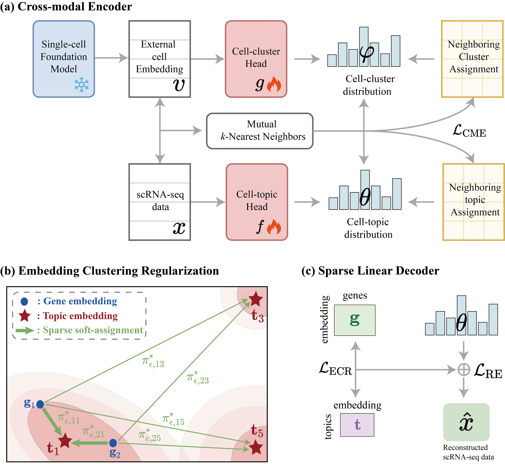

# $scE^2TM$: Toward Interpretable Single-Cell Embedding via Topic Modeling

The full description of $scE^2TM$ and its application on published single cell RNA-seq datasets are available.


The repository includes detailed installation instructions and requirements, scripts and demos.


## 1 Schematic overview of $scE^2TM$.



**(a)** To better collaborate the information of different modalities, clusters and topic heads are trained based on mutually refined neighborhood information by encouraging consistent clustering assignments of mutual nearest neighbors of the corresponding cells of different modalities in the embedding space. 
**(b)** ECR clusters gene embeddings $g_j$ (•) as samples and topic embeddings $t_k$ (★) as centers with soft assignment $\pi^{*}_{\epsilon,jk}$. Here, ECR pushes $g_1$ and $g_2$ close to $t_1$, and away from $t_3$ and $t_5$.
**(c)** Sparse linear decoders learn topic embeddings and gene embeddings as well as sparse topic-gene dependencies during reconstruction, thus ensuring model interpretability.
## 2 Installation
Create a new python environment.
```bash
conda create --name  scE2TM_env python=3.8.8
conda activate scE2TM
```

Install the dependencies from the provided requirements.txt file.
```bash
pip install -r requirements.txt
```
Installation typically completes in approximately 1.5 hours.
## 3 Usage

### Data format

$scE^2TM$ requires the input of cell-by-cell gene matrices, external embedding of cells, and true cell type information in .CSV object format.

The true cell type information is only used for prediction accuracy assessment.

We provide default data (Wang) for users to understand and debug the $scE^2TM$ code.


### Training

```bash
python run.py
```
On the provided example dataset, the demo completes in about one minute.

### Tutorial

We provide three tutorials in the `tutorial` directory that introduce the usage of $scE^2TM$ and reproduce the main quantitative results:

- [Clustering and Interpretable Evaluation](tutorial/Clustering-and-Interpretable-Evaluation.ipynb)
- [Pathway Enrichment](tutorial/Pathway-Enrichment.ipynb)
- [Topic gene embedding](tutorial/Topic-gene-embedding.ipynb)

## Reference

If you use $scE^2TM$ in your work, please cite

## License

This project is licensed under the MIT License.
