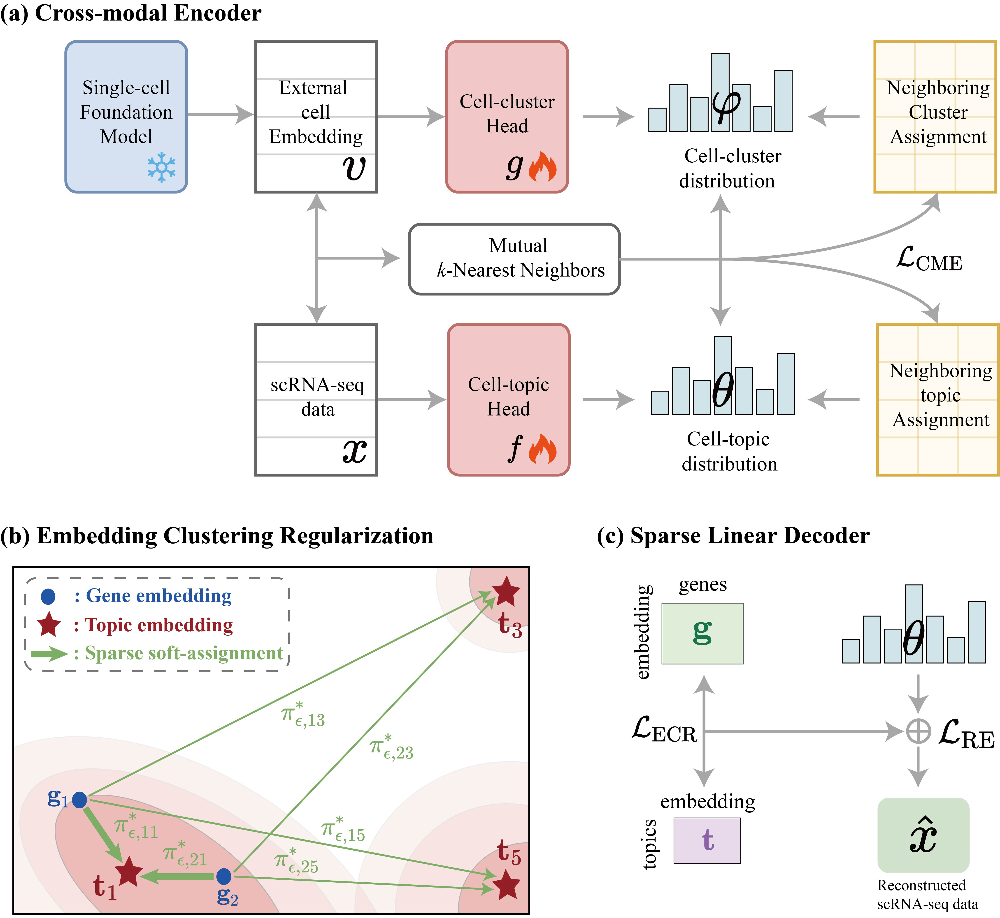

# $scE^2TM$: Toward Interpretable Single-Cell Embedding via Topic Modeling

[](https://badge.fury.io/py/scE2TM)
[](LICENSE.txt)

The full description of $scE^2TM$ and its application to published single-cell RNA-seq datasets are available in our paper.

---

## 📖 Overview

$scE^2TM$ is a framework for interpretable single-cell embedding learning via topic modeling. It integrates external single-cell foundation-model embeddings with gene expression data and learns sparse topic-gene dependencies for improved interpretability.

### Schematic overview of $scE^2TM$



**(a)** To better collaborate information from different modalities, clusters and topic heads are trained based on mutually refined neighborhood information by encouraging consistent clustering assignments of mutual nearest neighbors of corresponding cells across modalities in the embedding space.

**(b)** ECR clusters gene embeddings $g_j$ (•) as samples and topic embeddings $t_k$ (★) as centers with soft assignment $\pi^{*}_{\epsilon,jk}$.

**(c)** Sparse linear decoders learn topic embeddings, gene embeddings, and sparse topic-gene dependencies during reconstruction, thus ensuring model interpretability.

---

## 🔧 Installation

> **Note**: The complete installation process, including environment setup and dependency installation, typically takes around **1–1.5 hours**.

### 1. Create a conda environment

```bash
conda create --name scE2TM_env python=3.8.8 -y
conda activate scE2TM_env
```

### 2. Install PyTorch

```bash
pip install torch==1.9.1+cu102 torchvision==0.10.1+cu102 torchaudio==0.9.1 \
    -f https://download.pytorch.org/whl/torch_stable.html
```

---

## 3. Install scE²TM

### Option A: Install from PyPI (recommended for users)

| Hardware | Command |
|----------|----------|
| CPU | `pip install scE2TM` |
| GPU | `pip install scE2TM[gpu]` |

---

### Option B: Install from source (recommended for developers)

```bash
git clone https://github.com/nbnbhwyy/scE2TM.git
cd scE2TM
```

Then install dependencies based on your hardware:

| Hardware | Command |
|----------|----------|
| CPU | `pip install -r requirements-cpu.txt` |
| GPU | `pip install -r requirements-gpu.txt` |

---

## 🚀 Quick Start

> **Label usage:** scE²TM is label-free by default. Cell-type annotations are not used for model training. The optional `--use_labels` flag, or `use_labels=True` in the Python API, only enables label-dependent evaluation metrics such as ARI, NMI, and Purity when ground-truth annotations are available.

### Data format

$scE^2TM$ expects the following input files in CSV format:

- **Gene expression matrix**: cell-by-gene matrix (`*_HIGHPRE.csv`)
- **Cell type annotations**: ground-truth labels (`*_cell_anno.csv`) *(optional)*
- **Foundation-model embeddings**: pre-trained cell embeddings (`*.csv`)

We provide the **Wang** dataset as a default example to help users understand and debug the code.

### Run $scE^2TM$

#### Basic run

```bash
python run.py
```

On the provided Wang example dataset, the demo typically finishes within 1–2 minutes on an NVIDIA RTX 3090 GPU. We also thank the anonymous reviewer for testing the CPU-only workflow on macOS; based on the reviewer’s report, the same example may require approximately 10–15 minutes on CPU-only systems depending on hardware and software configuration.

#### Specify dataset and number of topics

```bash
python run.py --dataset_name Wang --num_topics 50
```

#### Choose GPU device (`-1` for CPU)

```bash
# Run on GPU 0
python run.py --gpu_id 0

# Run on CPU
python run.py --gpu_id -1
```

#### Use cell type labels for evaluation (optional)

```bash
# Enable label‑dependent metrics (ARI, NMI, etc.)
python run.py --use_labels
```

#### Full parameter example

```bash
python run.py \
    --dataset_name Wang \
    --num_topics 100 \
    --num_neighbors 15 \
    --num_top_genes 10 \
    --tac_weight 1.0 \
    --gpu_id 0 \
    --data_dir ./data \
    --output_dir ./output \
    --use_labels
```

#### Jupyter demo

```bash
jupyter notebook scE2TM_demo_on_Wang_dataset.ipynb
```

#### Using the high‑level Python API

The package provides a simple function `scE2TM()` that returns all results directly.

```python
from scE2TM import scE2TM

# Basic label‑free run (no cell type annotations needed)
results = scE2TM(
    dataset_name='Wang',          # dataset name
    data_dir='./data',            # directory containing CSV files
    output_dir='./output',        # where to save outputs
    num_topics=100,               # number of topics (K)
    num_neighbors=15,             # number of neighbors for graph construction
    weight_loss_ECR=20.0,        # weight for the ECR loss
    epochs=500,                   # total training epochs
    gpu_id=0,                     # GPU device; use -1 for CPU
)

# With cell type labels (evaluation metrics ARI, NMI, Purity will be computed)
results = scE2TM(
    dataset_name='Wang',
    use_labels=True,              # enable label‑dependent metrics
    num_topics=100,
    num_neighbors=15,
    weight_loss_ECR=20.0,
    epochs=500,
    gpu_id=0,
)

# Access the resulting matrices
beta = results['topic_gene_matrix']        
theta = results['cell_topic_matrix']      # latent cell-topic scores (cells × topics)
topic_emb = results['topic_embeddings']
gene_emb = results['gene_embeddings']
```

### Output files

After successful execution, the following files are saved in `output/Wang/`:

| File | Description |
|------|-------------|
| `Wang.pth` | Trained model checkpoint |
| `Wang_topic_distribution.csv` | Cell-topic distribution (theta, Latent cell-topic scores (cells × topics)) |
| `Wang_topic_embedding.csv` | Topic embeddings |
| `Wang_gene_embedding.csv` | Gene embeddings |
| `Wang_tg.csv` | Topic-gene matrix (beta) |

---

## 📚 Tutorials

We provide tutorials in the `tutorial/` directory covering both basic usage and the main downstream analyses used in the paper.

| Tutorial | Description |
|----------|-------------|
| `Prepare_foundation_embeddings_scGPT.ipynb` | Generate foundation-model embeddings using scGPT for input to scE2TM. |
| `Topic_number_selection_with_stability.ipynb` | Use topic stability, diversity, coherence, and clustering metrics (ARI/NMI, optional) to guide the choice of the optimal number of topics (K). |
| `Clustering and Interpretable Evaluation.ipynb` | Evaluate clustering performance and interpretability of the learned topics. |
| `Consistency between rare types and topics.ipynb` | Evaluate how well learned topics capture rare cell populations and their consistency with rare cell types. |
| `Pathway Enrichment.ipynb` | Perform pathway enrichment analysis on learned topics. |
| `Topic gene embedding.ipynb` | Visualize and analyze topic-gene embeddings. |
| `Topic perturbation experiment.ipynb` | Analyze the biological effects of perturbing topic intensities. |

---

## ⚖️ Baseline Tutorials

We also provide tutorials for several relevant baselines in the `baseline/` directory:

- `scVI.ipynb` – Variational inference for single-cell data
- `scVI-LD.ipynb` – scVI with latent Dirichlet allocation
- `scETM.ipynb` – Embedded topic model for single-cell data
- `d-scIGM.ipynb` – Deep single-cell interpretable generative model
- `baseline_louvain_clustering.ipynb` – Louvain clustering on PCA‑reduced expression data
- `baseline_cNMF.ipynb` – Consensus NMF topic modeling
- `baseline_SPECTRA.ipynb` – SPECTRA factor analysis

These notebooks are designed to help users reproduce baseline results in a consistent environment. After setting up the main $scE^2TM$ environment, each baseline tutorial explains:

1. any additional package installation required for that baseline,
2. how to run the method on the provided example dataset, and
3. how to obtain outputs for comparison with $scE^2TM$.

In general, the workflow is:

```bash
conda activate scE2TM_env
```

Then open the corresponding notebook in `baseline/` and follow the dependency installation and execution instructions provided there.

---

## 📁 Repository Structure

```text
scE2TM/
├── baseline/      # Baseline tutorials: scVI, scVI-LD, scETM, d-scIGM
├── configs/       # Configuration files
├── data/          # Example datasets and processed inputs
├── models/        # Core model implementations
├── runners/       # Training / running utilities
├── tutorial/      # scE2TM tutorials and downstream analysis notebooks
├── utils/         # Utility functions
├── run.py         # Main entry point
├── requirements.txt
└── LICENSE.txt
```

---

## 📄 License

This project is licensed under the MIT License. See [LICENSE.txt](LICENSE.txt) for details.

---

## 📬 Contact

For questions or support, please open an issue on GitHub or contact:

- 13247702278@163.com
